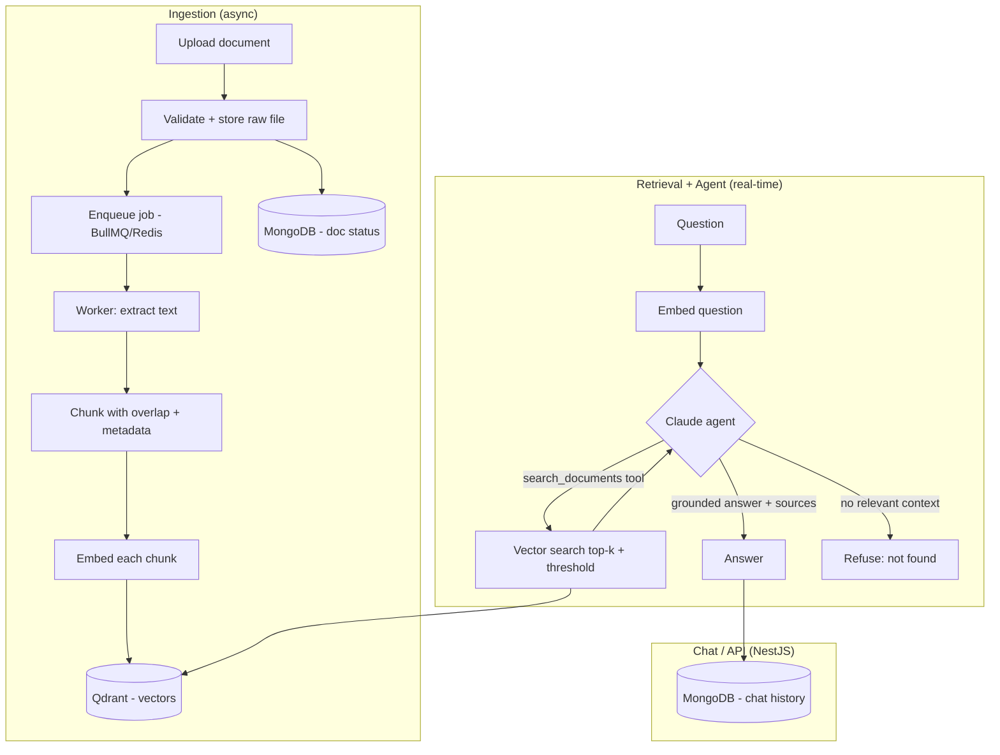

# Agentic RAG Knowledge Assistant

A backend service for chatting with your own documents. Upload a corpus of documents, then ask questions in natural language and get accurate answers grounded strictly in those documents, each with a sources list. When the documents don't support an answer, it says so rather than making one up.

Built to demonstrate production-grade **agentic RAG**: a Claude-powered agent decides *whether* to search the knowledge base, *how many times*, and *whether it has enough context* before answering, via tool-calling, rather than blindly retrieving on every question.

## Why this exists

Attaching a few files to a chat works fine at small scale. It breaks down when the corpus exceeds the context window, must persist across sessions, serve many users, or needs controlled, cited, cost-efficient answers. That is the problem RAG infrastructure solves, and this project implements it end to end.

## What it does

- Ingests documents asynchronously (upload returns immediately; processing happens in the background)
- Extracts, chunks, and embeds document text into a vector store
- Answers questions via an agent that retrieves relevant chunks and composes a grounded response
- Returns a sources list with every answer, and refuses when retrieval doesn't support one
- Maintains conversation history for natural follow-up questions

## Architecture

Three logical flows: ingestion (async), retrieval + agent (real-time), and the chat/API layer.



Text description of the flows:

**Ingestion (async).** A document is uploaded to the API, validated, and its raw file stored locally (behind a storage interface, so S3 is a drop-in swap later). A job is enqueued on Redis via BullMQ and the API returns immediately with a document ID. A worker extracts the text (digital documents only in v1, no OCR), splits it into overlapping chunks that carry source and position metadata, embeds each chunk with a local open-source model, and upserts the vectors into Qdrant. Document status is tracked in MongoDB.

**Retrieval + agent (real-time).** A question is embedded with the same model used at ingestion. A Claude agent decides whether to search, calls a `search_documents` tool against Qdrant (top-k with a similarity threshold, in a bounded loop so it can refine), and composes an answer strictly from the retrieved context. Every answer carries a sources list. When retrieval returns nothing relevant, the agent refuses instead of hallucinating. Retrieved document text is treated as untrusted input (prompt-injection aware).

**Chat / API.** NestJS exposes endpoints for documents (upload, list, status, delete), chat (ask a question), conversations (history), and health probes. Responses are plain JSON. Conversation history is stored in MongoDB; the last N turns are passed to the agent for continuity, but fresh retrieval runs on every question.

## Tech stack

| Concern | Choice |
| --- | --- |
| Framework | NestJS + TypeScript |
| Queue / cache / sessions | Redis + BullMQ |
| Vector store | Qdrant (self-hosted) |
| Metadata + chat history | MongoDB |
| Embeddings | Local open-source model (sentence-transformers) |
| LLM / agent | Claude API (Anthropic) |
| File storage | Local filesystem (S3 adapter behind interface) |
| Infra | Docker, Kubernetes, GitHub Actions |

## Getting started

> Prerequisites: Node.js v20+, Docker, an Anthropic API key.

```bash
# install dependencies
npm install

# copy environment template and fill in values
cp .env.example .env

# start dependencies (Redis, Qdrant, MongoDB) via Docker
# docker compose up -d   # (added later in the build)

# run the app in watch mode
npm run start:dev
```

API documentation (Swagger) is available at `/api` when the app is running.

## Configuration

All configuration is via environment variables. See `.env.example` for the full list. Secrets are never committed.

## Project status

v1 in active development. Built incrementally in dependency order: ingestion, then retrieval + agent, then chat/API, then infra.

## Roadmap

Planned enhancements beyond v1:

- [ ] Inline citations (claim-level source tagging, in addition to the sources list)
- [ ] OCR support for scanned documents and image-only PDFs
- [ ] Reranking of retrieved results for higher precision
- [ ] Hybrid search (vector + keyword)
- [ ] Query rewriting / expansion
- [ ] Multi-agent decomposition (researcher / summarizer / critic)
- [ ] Multi-tenant isolation
- [ ] SSE streaming responses
- [ ] Conversation-history summarization for long sessions
- [ ] Full authentication (v1 ships a simple API-key guard)
- [ ] S3 storage adapter (interface already in place)

## License

MIT